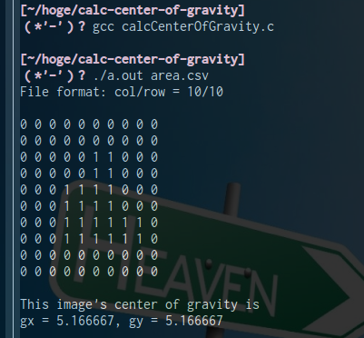

# Calculate binary image's center of gravity
You simply input binary image, and run this software calculate that center of gravity(CG).

## Motivation
At experiment, I want to make sure that my calculated result is correct. So I wrote this code.

## Requirement
* Linux OS(Linux Mint 17.1 is OK)
* gcc compiler
* file that you want to calculate CG of binary image(CSV)
  
## Usage

1. Clone this repository.
2. Change directory that you cloned this repository.
3. Put the CSV data into directory.
4. Compile code.

   ~~~~
   $ gcc calcCenterOfGravity.c
   ~~~~
   
5. Run code with command line argument.
   
   ~~~~
   $ ./a.out filename.csv
   ~~~~

## Example

## License
This code is free software; you can redistribute it and/or modify it.
